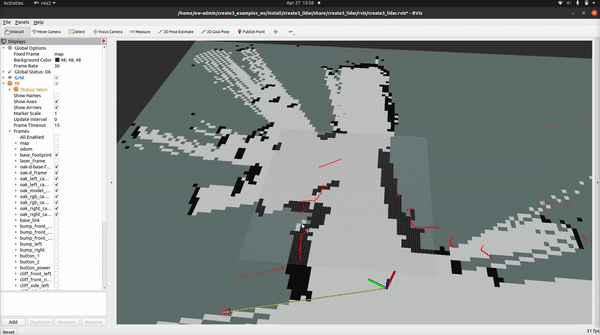
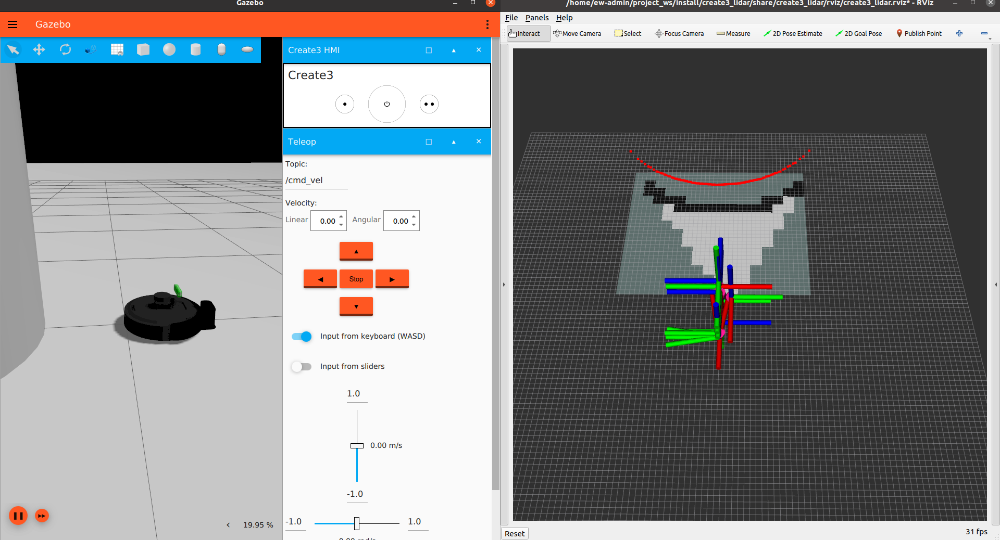
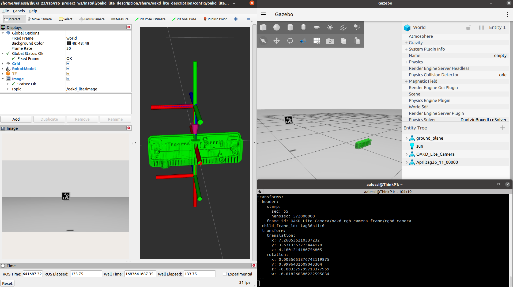
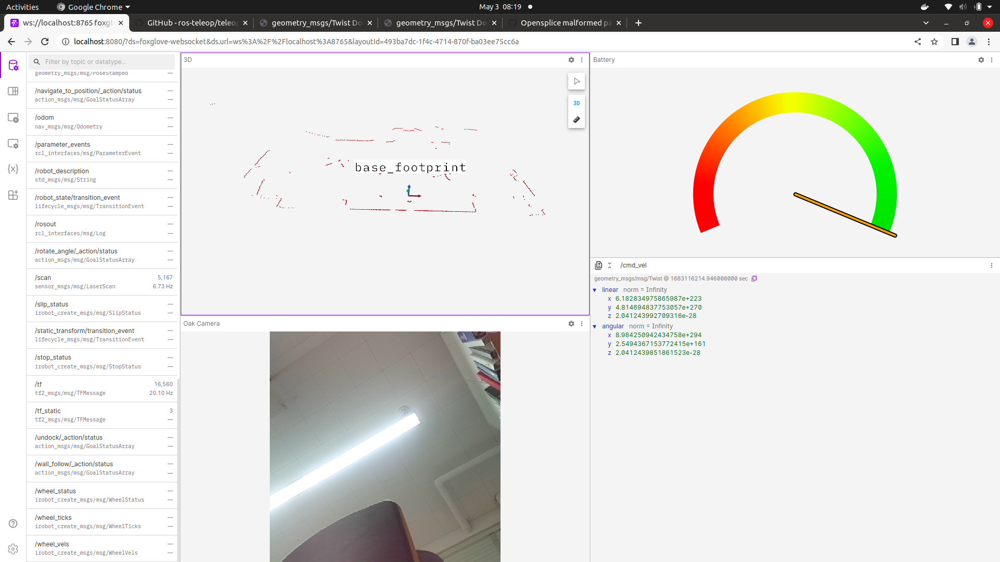

# Create3 Project

A gazebo simulation environment and hardware libraries for executing SLAM and AprilTag detection with a Create3 robot, an RPLIDAR-A1 laser range scanner, and an Oak-D Lite camera. 

## About the Project
This project was created for EN.530.707 - Robot System Programming at Johns Hopkins University.

Contributors:
- Alex Alessi
- Allan Elsberry
- Spencer Powers
- Trevor Schwehr

## Project Media



## Build the Packages
Note: the following build instructions were tested on a fresh Galactic desktop installation.

Create a workspace
```
mkdir ~/project_ws
cd ~/project_ws
mkdir src
cd src
```
Clone this repository and build the packages:
```
git clone https://github.com/ender18g/Create3_Project.git
```
Clone the other required repositories:
```
vcs import < Create3_Project/required_repos.repos
```
Install the dependencies
```
cd ~/project_ws
rosdep update --include-eol-distros
sudo apt-get update
rosdep install --from-path src -yi
```
Build the packages
```
colcon build
```
Note: if the build freezes, consider limiting memory usage by building packages sequentially:
```
colcon build --executor sequential
```
Finally, source the workspace
```
source install/setup.bash
```

## Simulation with Ignition Gazebo

To run lidar SLAM in simulation with Ignition Gazebo, run the example launch file:
```
ros2 launch create3_sim_total create3_sim_SLAM.launch.py
```


To run AprilTag Detection in simulation with Ignition Gazebo, run the example launch file:
```
ros2 launch apriltag_gazebo apriltag_simulation.launch.py
```

To view AprilTag tranforms run the following command
```
ros2 topic echo /tf
```

## Using the Hardware
### Starting Robot
Power on the create3 by holding down the power button. The Raspberry Pi 4 will boot and will automatically begin publishing Lidar Scan messages, camera images, along with robot information topics.

 To setup and manually start the sensor nodes on the Raspberry Pi:
 1. Flash an Ubuntu 20.04 image onto an SD Card for the Raspberry pi:
 2. Install ROS2 Galactic on the SD Card
 3. Install the following ROS2 Galactic Packges on the Raspberry Pi:
 ```
 sudo apt update
 sudo apt install ros-galactic-rplidar-ros
 sudo apt install ros-galactic-depthai-ros
 ```
4. To manually start the RPLIDAR publisher:
```
ros2 launch rplidar_ros rplidar.launch.py
```
5. To manually start the Oak D Lite Camera publisher:
```
ros2 launch depthai_examples mobile_publisher.launch.py
```

To drive the robot from a laptop, use teleop_twist_keyboard:
```
ros2 run teleop_twist_keyboard teleop_twist_keyboard
```
Use the keyboard to command the robot

### SLAM
Open the SLAM toolbox:
```
ros2 launch create3_lidar slam_toolbox_launch.py
```

Start RVIZ2
```
ros2 run rviz2 rviz2 -d  ~/project_ws/install/create3_lidar/share/create3_lidar/rviz/create3_lidar.rviz
```

### Camera Calibration

Install Camera Calibration Parser, Camera Info Manager and Launch Testing Ament Cmake using operating system’s package manager:

```
sudo apt install ros-<ros2-distro>-camera-calibration-parsers
sudo apt install ros-<ros2-distro>-camera-info-manager
sudo apt install ros-<ros2-distro>-launch-testing-ament-cmake
```

With the camera connected to your system run the following command to begin publishing camera images
```
ros2 launch depthai_examples mobile_publisher.launch.py
```

Camera images should now be publishing to the "/color/image" topic. You can check this with 
```
ros2 topic echo /color/image
```

Begin camera calibration by running. Note --size and --sqaure will vary depending upon the exact checkerboard being used for calibration.
```
ros2 run camera_calibration cameracalibrator --size 7x10 --square 0.0195 --pattern chessboard --ros-args -r image:=/color/image -p camera:=/color/camera_info
```

Once all four calibration bars are green pressing calibrate and save will generate a calibration.tar.gz file, saved to "/tmp/" directory. Running
```
tar -xvf calibration.tar.gz
```
will unzip this file.
 ost.yaml will contain the desired camera parameters.


## Running Foxglove Studio




Foxglove studio allows viewing visualizations and subscribing/publishing to ros2 topics through the web browser. This allows students to view the robot status and performance without having to install ROS2. Only a web browser (Chrome is recommended) is required.

Install Foxglove bridge
```
sudo apt install ros-galactic-foxglove-bridge
```

Start your Foxglove bridge on a computer with ROS2 Galactic:
```
ros2 run foxglove_bridge foxglove_bridge_launch.xml port:=8765
```

Now visit studio.foxglove.dev to see your dashboard and visualizations.


